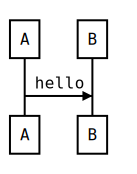

# seq - cli

Generate svg for [js  sequence diagrams](https://github.com/bramp/js-sequence-diagrams)

## Instal

```bash
npm install seq-cli
```

## Usage

```bash
seq-cli -i example/hello.seq
```

```
A -> B: Hey!
Note Over A: this is a note
C -> D: How are you
D --> E: Good day
E ->> F: HAHA
```

