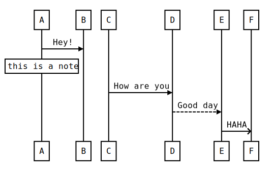

# seq - cli

Generate svg for [js  sequence diagrams](https://github.com/bramp/js-sequence-diagrams)

## Instal

```bash
npm install seq-cli
```

## Usage

```
A -> B: hello
```

```bash
seq-cli -i example/hello.seq
```


